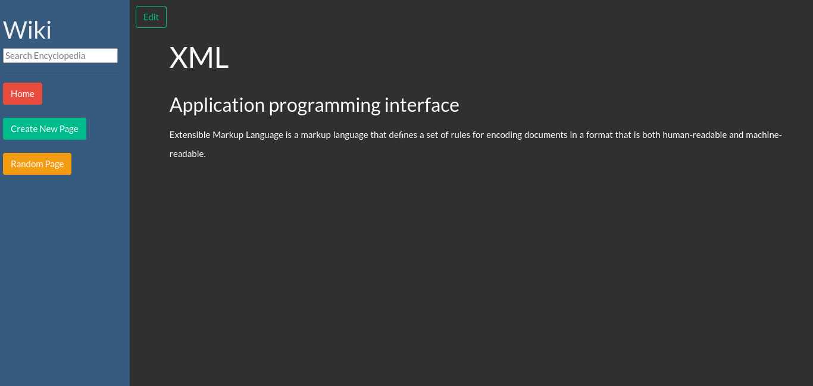

# CS50 Wiki Solution With Django

  

This is a solution to the [CS50 Project1 - Wiki](https://cs50.harvard.edu/web/2020/projects/1/wiki/)

  

## Table of contents

  

-  [Overview](#overview)

-  [The challenge](#the-challenge)

-  [Screenshot](#screenshot)

-  [Links](#links)

-  [My process](#my-process)

-  [Built with](#built-with)

-  [What I learned](#what-i-learned)

-  [Author](#author)

  

  

## Overview

  

### The challenge

  

Users should be able to:

  

- Create a page with Markdown Language
- Edit Pages 
- Search Pages

  

### Screenshots

  

### Links

  

- Solution URL: [My Solution](https://github.com/JhosianGtZ/web50-projects-2021-1-wiki)

## My process

  

### Built with

  

- Semantic HTML5 markup

- CSS custom properties

- [Django ](https://www.djangoproject.com/)

- [Bootswatch](https://bootswatch.com/darkly/)

  

### What I learned

I've learned how to create dynamic sites using Django, how to display pages created with the Markdown language, and how to manipulate site data.

## Author

  

- Website - [Jhosian Gutiérrez](https://jhosiangtz.github.io/portfolio/)
- Linkedin - [Jhosian Gutiérrez](https://www.linkedin.com/in/jhosiangtz/)

  

